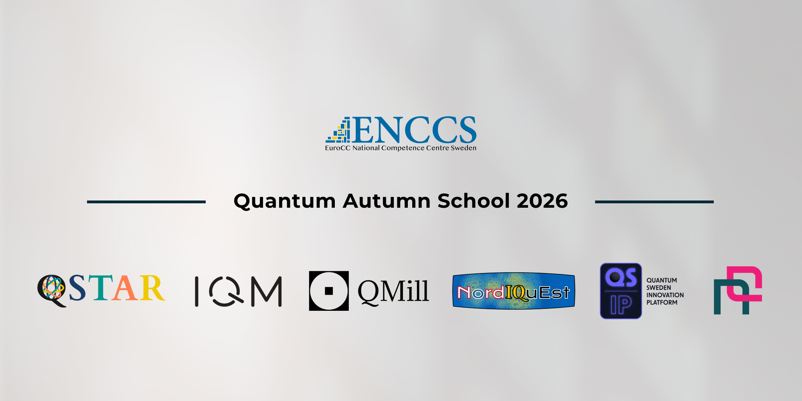
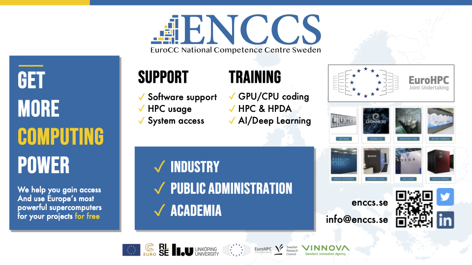

# Quantum Autumn School 2026

Wellcome to 2026 edition of the Quantum Autumn School! This year we have a couple of differences with respect to previous editions. The first and most important is that the school will be held **in-person only**.

:::{admonition} Important information
:class: important
- Dates: November 2nd to 4th 2026 
- Place: Stockholm, Sweden. The exact venue will be sent by email to the accepted participants.

In order to do the exercises and practice is important to **bring a laptop**
:::

:::{prereq}

- Knowlegde of the Python programming language.
- Knowlegde of linear algebra.
- Own laptop
- A bit of motivation :)
:::

---
## Schedule:

### Monday 2nd November — Basics

| Time | Session / Topic |
| :--- | :--- |
| **09:00 - 09:10** | Quantum Computing in RISE and Sweden. |
| **09:10 - 09:20** | QSTAR |
| **09:20 - 09:30** | Nordiquest |
| **09:30 - 09:40** | Nordic Quantum |
| **09:40 - 09:50** | ENCCS and EuroHPC |
| **09:50 - 10:00** | Introduction to the School |
| **10:00 - 10:10** | Break |
| **10:10 - 11:00** | Introduction to quantum computing I - Basic concepts |
| **11:00 - 11:10** | Break |
| **11:10 - 12:00** | Introduction to quantum computing II - Hardware implementation |
| **12:00 - 13:00** | Lunch |
| **13:00 - 13:50** | Introduction to Quantum computing III - Basics on quantum algorithms |
| **13:50 - 14:00** | Break |
| **14:00 - 15:30** | Building your own quantum computer in Python |
| **15:30 - 16:30** | Visit to the KTH fridge to see a quantum computer |

### Tuesday 3rd November — Intermediate

| Time | Session / Topic |
| :--- | :--- |
| **09:00 - 10:00** | Introduction to quantum algorithms I - The quantum phase estimation |
| **10:00 - 10:10** | Break |
| **10:10 - 11:00** | Introduction to quantum algorithms II - Variational quantum algorithms part 1: VQE |
| **11:00 - 11:10** | Break |
| **11:10 - 12:00** | Introduction to quantum algorithms III - Variational quantum algorithms part 2: QAOA |
| **12:00 - 13:00** | Lunch |
| **13:00 - 13:50** | Introduction to Quantum Cryptography |
| **13:50 - 14:00** | Break |
| **14:00 - 15:30** | Practicing on algorithms: Hamiltonian simulation |
| **15:30 - 16:30** | Demo on sending encrypted messages with QKD |

### Wednesday 4th November — Advanced

| Time | Session / Topic |
| :--- | :--- |
| **09:00 - 10:00** | Applications of Quantum Computing I: Quantum Chemistry |
| **10:00 - 10:10** | Break |
| **10:10 - 11:00** | Applications of Quantum Computing II: Quantum Machine Learning |
| **11:00 - 11:10** | Break |
| **11:10 - 12:00** | Applications of Quantum Computing III: Cryptography |
| **12:00 - 13:00** | Lunch |
| **13:00 - 13:50** | Compression, obfuscation and applications in cryptography. |
| **13:50 - 14:00** | Break |
| **14:00 - 15:30** | Practicing on applications in a real quantum computer in working groups |
| **15:30 - 16:30** | Closing of the school and introduction to the Hackathon. |

## Lesson materials
The lesson materials for every day in the school will be uploaded here.

```{toctree}
:caption: Materials
:maxdepth: 1

episode.md
```

## Useful references
We will be using Qrisp as the python library for exercises and the IQM Resonance platform. IQM also provides useful tutorials for learning.
- [Qrisp library](https://qrisp.eu)
- [IQM Academy](https://www.iqmacademy.com)
- [IQM Resonance](https://iqm.tech/products/iqm-resonance/)

A lot of materials can be found in the webpage of the [Quantum Autumn School 2025](https://enccs.github.io/qas2025/).

## Partners & organizers

This school is organized by EuroCC competence centres of Sweden ENCCS in collaboration with QSTAR Center for Quantum Computing and Applications, Linköping University, Nordiquest, IQM, Nordic Quantum, QMill and QSIP.



## Registration & logistics

:::{important}

- 📋 **[Register Now](https://enccs.se/event/quantum-computing-school-2026-in-sweden/)**
- **Capacity**: Maximum 80 people.
- **Format**: **In-person only** event in Stockholm.
:::

### Venue

The Quantum Autumn School 2026 will be held in Stockholm, Sweden. Detailed address and directions will be shared via email with registered participants.

### Accommodation

There are multiple hotels in the vicinity. Below you can find some hotels in order of proximity:

- **[Elite Hotel Arcadia Stockholm](https://www.elite.se/hotell/stockholm/elite-hotel-arcadia-stockholm/?utm_source=google&utm_medium=organic&utm_campaign=google-local&utm_content=stockholm_arcadia)**
- **[Hotel Ruth](https://www.hotelruth.se/)**
- **[Scandic Park](https://www.scandichotels.com/en/hotels/scandic-park)**


### Public transport

Download the public transport app to purchase tickets:
- **[iOS App Store](https://apps.apple.com/se/app/sl-biljetter/id918418291)**
- **[Google Play](https://play.google.com/store/apps/details?id=com.sl.SLBiljetter)**

**Ticket Options:**
- Single journey ticket
- 24-hour ticket  
- 72-hour ticket

You can also use your regular credit card by scanning it on the metro and all buses. **[More information about contactless payments](https://sl.se/en/in-english/fares--tickets/contactless-pay-as-you-go)**.

**From Arlanda Airport:**
- Take a taxi
- **[Arlanda Express](https://www.arlandaexpress.com/)** - fast train (20 minutes to T-Centralen)
- Flygbussarna - airport bus (approximately 45 minutes to T-Centralen)

---

## About ENCCS



The EuroHPC Centre of Excellence in Computing Applications (ENCCS) develops and optimizes computational applications for current and upcoming exascale systems. We provide training, support, and expertise in high-performance computing and emerging technologies like quantum computing.

:::{seealso}
**Learn More**
- [ENCCS Website](https://enccs.se)
:::

---

# Let's stay connected

:::{admonition} Join our community and stay updated!
:class: tip

Stay in the loop with ENCCS for updates, training opportunities, and news about connecting HPC, AI, and quantum computing!

**🌐 Visit our website:**
- **[ENCCS Website](https://enccs.se/)** - HPC services, on-boarding, training courses, webinars, tutorials, blog posts, and upcoming events

**📧 Subscribe to our newsletter:**
- **[ENCCS Newsletter](https://enccs.se/newsletter)** - Get monthly updates delivered to your inbox

**💬 Follow us on social media:**
- **[LinkedIn](https://www.linkedin.com/company/enccs/posts)** - Latest news, events, and professional updates
- **[YouTube](https://www.youtube.com/@enccs)** - Tutorials, webinars, and educational content

Stay connected with the European quantum computing community!
:::
